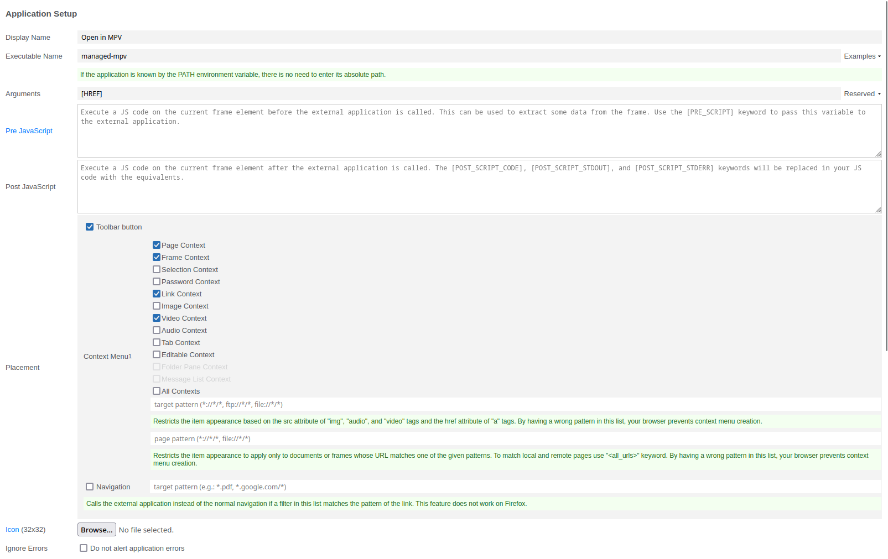

# Managed MPV

A scuffed wrapper for `mpv` that manages the playlist. Start the server using `managed-mpv-server`.

Append URLs to the playlist by calling `managed-mpv`:

```bash
managed-mpv '$VIDEO_URL'
```

A new `mpv` instance will be started unless it's already running.

## Firefox Integration

[External Application Button](https://addons.mozilla.org/en-US/firefox/addon/external-application/)

### Configuration

